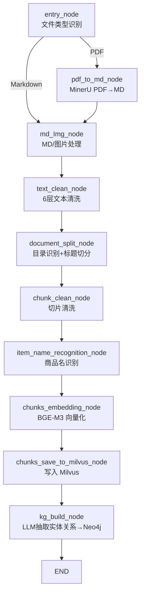
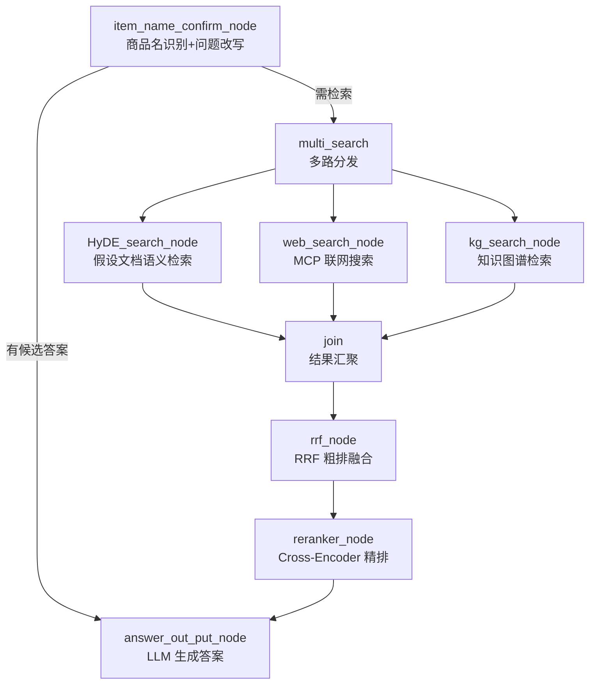

# DocuBrain-RAG

> 问器知识库 —— 基于 LangGraph 的多路检索增强生成（RAG）知识库系统

DocuBrain-RAG 是一个面向**工业产品技术文档**（说明书、操作手册、维修手册等）的知识库问答系统。它能够把 PDF / Markdown 文档自动解析、清洗、切分、向量化并构建知识图谱，入库后通过「语义检索 + 联网搜索 + 知识图谱」三路召回与 RRF 融合、Reranker 精排，最终由大模型生成带来源的高质量回答。

---

## ✨ 功能特性

- **文档自动入库**：PDF 通过 [MinerU](https://github.com/opendatalab/MinerU) 高精度解析为 Markdown，支持 PDF / Markdown 双格式上传
- **6 层文本清洗管线**：编码统一 → 空白规整 → 结构噪声去除 → 精确/模糊去重 → 敏感信息脱敏 → 术语归一化
- **智能切分**：按 Markdown 标题层级切分 + 目录页识别与移除 + 过大二次切分、过小合并
- **商品名识别**：LLM 提取产品/商品名称，写入独立向量集合用于检索对齐
- **混合向量检索**：BGE-M3 生成稠密（Dense）+ 稀疏（Sparse）向量，Milvus 加权混合检索
- **知识图谱**：LLM 抽取实体关系写入 Neo4j，查询端图遍历召回结构化关联信息
- **三路检索融合**：HyDE 语义检索 + 阿里云百炼 MCP 联网搜索 + Neo4j 知识图谱，RRF 加权融合去重
- **精排重排**：BGE-Reranker-v2-m3 Cross-Encoder 逐条打分 + Gap-based 自适应截断
- **流式输出**：SSE（Server-Sent Events）实时推送节点进度与生成内容
- **多轮对话**：基于 MongoDB 的历史对话管理与指代消解

---

## 🏗️ 系统架构

系统由两条 LangGraph 状态图工作流组成：**入库流程** 与 **查询流程**。

### 入库流程（Import Pipeline）



### 查询流程（Query Pipeline）



### 三路检索定位

| 通路 | 数据源 | 定位 |
|------|--------|------|
| **HyDE** | Milvus 内部知识库 | query → LLM 生成假设文档 → Dense+Sparse 混合检索，语义匹配 |
| **Web** | 阿里云百炼 MCP 联网搜索 | 补充时效性信息与外部知识 |
| **KG** | Neo4j 图数据库 | query → LLM 提取实体 → 图遍历，结构化关联匹配 |

---

## 🧰 技术栈

| 类别 | 技术 |
|------|------|
| Web 框架 | FastAPI + Uvicorn |
| 流程编排 | LangGraph（StateGraph 状态图） |
| 文本处理 | LangChain Text Splitters、MinerU |
| 嵌入模型 | BGE-M3（稠密 + 稀疏混合向量） |
| 重排模型 | BGE-Reranker-v2-m3（Cross-Encoder） |
| 向量数据库 | Milvus（混合检索、标量过滤） |
| 图数据库 | Neo4j（知识图谱存储与遍历） |
| 文档数据库 | MongoDB（对话历史） |
| 对象存储 | MinIO |
| 大模型 | OpenAI 兼容 API（阿里云 DashScope / Qwen 系列） |
| 联网搜索 | 阿里云百炼 MCP（`bailian_web_search`） |

---

## 📁 目录结构

```
DocuBrain-RAG/
├── knowledge/
│   ├── front/                      # 前端服务层（FastAPI）
│   │   ├── api/                    # 路由：import_router / query_router
│   │   ├── schema/                 # 请求/响应数据模型
│   │   ├── service/                # 业务服务：导入 / 查询 / 任务
│   │   ├── utils/                  # 依赖注入、路径、任务状态、SSE
│   │   └── front/                  # 静态页面：import.html / chat.html
│   ├── processor/                  # 核心处理流水线
│   │   ├── import_process/         # 入库流程（LangGraph 状态图）
│   │   │   ├── import_graph.py     #   入库图定义
│   │   │   ├── nodes/              #   各处理节点
│   │   │   ├── state.py            #   状态类型定义
│   │   │   └── config.py           #   配置
│   │   └── query_process/          # 查询流程（LangGraph 状态图）
│   │       ├── main_graph.py       #   查询图定义
│   │       ├── nodes/              #   各查询节点
│   │       ├── state.py            #   状态类型定义
│   │       └── config.py           #   配置
│   ├── prompts/                    # 提示词模板
│   │   ├── query/                  #   查询端提示词
│   │   └── upload/                 #   入库端提示词
│   ├── utils/                      # 基础设施客户端封装
│   │   ├── bge_client_utils.py     #   BGE-M3 嵌入客户端
│   │   ├── reranker_client_utils.py#   BGE-Reranker 重排客户端
│   │   ├── llm_client_utils.py     #   LLM 客户端
│   │   ├── milvus_client_utils.py  #   Milvus 客户端 + 混合检索
│   │   ├── neo4j_client_utils.py   #   Neo4j 客户端
│   │   ├── mongodb_client_utils.py #   MongoDB 客户端
│   │   ├── MinioClient.py          #   MinIO 客户端
│   │   └── sse_util.py             #   SSE 流式工具
│   └── test/                       # 测试
├── requirements.txt                # 依赖清单
└── .env.example                    # 环境变量示例
```

---

## 🚀 快速开始

### 1. 环境要求

- Python 3.10+
- [MinerU](https://github.com/opendatalab/MinerU)（PDF 解析，通过 `mineru[all]` 安装）
- 可访问的 Milvus / MongoDB / Neo4j / MinIO 服务（或本地 Docker 部署）
- 本地 BGE-M3 与 BGE-Reranker 模型文件
- 一个 OpenAI 兼容的 LLM API（如阿里云 DashScope）

### 2. 安装依赖

```bash
# 创建并激活虚拟环境
python -m venv .venv
# Windows
.venv\Scripts\activate
# Linux / macOS
source .venv/bin/activate

# 安装依赖
pip install -r requirements.txt
```

### 3. 配置环境变量

```bash
# 复制环境变量示例文件
cp knowledge/.env.example knowledge/.env

# 编辑 knowledge/.env，填入你的实际配置
```

关键配置项（详见 `.env.example`）：

| 变量 | 说明 |
|------|------|
| `OPENAI_API_KEY` / `OPENAI_API_BASE` | LLM API 密钥与地址 |
| `LLM_DEFAULT_MODEL` | 默认 LLM 模型 |
| `BGE_M3_PATH` | 本地 BGE-M3 模型路径 |
| `BGE_RERANKER_LARGE` | 本地 BGE-Reranker 模型路径 |
| `MILVUS_URL` | Milvus 连接地址 |
| `MONGO_URL` / `MONGO_DB_NAME` | MongoDB 连接与库名 |
| `NEO4J_URI` / `NEO4J_USERNAME` / `NEO4J_PASSWORD` | Neo4j 连接信息 |
| `MINIO_ENDPOINT` / `MINIO_ACCESS_KEY` / `MINIO_SECRET_KEY` | MinIO 连接信息 |
| `MCP_DASHSCOPE_BASE_URL` / `MCP_DASHSCOPE_API_KEY` | 阿里云百炼联网搜索 MCP |

### 4. 启动服务

系统包含两个独立服务：

```bash
# 导入服务（端口 8000）
python -m knowledge.front.api.import_router
# 或
python knowledge/front/api/import_router.py

# 查询服务（端口 8001）
python -m knowledge.front.api.query_router
# 或
python knowledge/front/api/query_router.py
```

启动后访问：

- **文件导入页面**：http://localhost:8000/import
- **智能问答页面**：http://localhost:8001/chat

---

## 🔌 API 接口

### 导入服务（默认端口 8000）

| 方法 | 路径 | 说明 |
|------|------|------|
| `GET` | `/import` | 文件上传页面 |
| `POST` | `/upload` | 上传文件，后台执行入库流水线 |
| `GET` | `/status/{task_id}` | 查询入库任务节点进度 |

### 查询服务（默认端口 8001）

| 方法 | 路径 | 说明 |
|------|------|------|
| `GET` | `/chat` | 问答页面 |
| `POST` | `/query` | 提交查询（支持流式 / 非流式） |
| `GET` | `/stream/{task_id}` | SSE 流式获取节点进度与答案 |
| `GET` | `/history/{session_id}` | 获取历史对话 |
| `DELETE` | `/history/{session_id}` | 清空历史对话 |

---

## 🔄 核心流程说明

### 入库流程节点

| 节点 | 职责 |
|------|------|
| `entry_node` | 文件类型识别（PDF/MD）、提取文件标题 |
| `pdf_to_md_node` | 调用 MinerU 将 PDF 解析为 Markdown |
| `md_Img_node` | 处理 Markdown 中的图片 |
| `text_clean_node` | 6 层文本清洗管线 |
| `document_split_node` | 目录页检测/解析/移除 + 按标题层级切分 |
| `chunk_clean_node` | 切片级清洗与质量标记 |
| `item_name_recognition_node` | LLM 提取商品名并向量化入库 |
| `chunks_embedding_node` | BGE-M3 生成稠密 + 稀疏向量 |
| `chunks_save_to_milvus_node` | 写入 Milvus 向量库 |
| `kg_build_node` | LLM 抽取实体关系，构建 Neo4j 知识图谱 |

### 查询流程节点

| 节点 | 职责 |
|------|------|
| `item_name_confirm_node` | 提取商品名 + 改写问题 + 向量检索对齐评分（支持指代消解） |
| `HyDE_search_node` | LLM 生成假设文档 → 混合检索内部知识库 |
| `web_search_node` | 调用百炼 MCP 联网搜索 |
| `kg_search_node` | LLM 提取实体 → Neo4j 图遍历 → 关联 chunk 召回 |
| `rrf_node` | 三路召回 RRF 加权融合去重（粗排） |
| `reranker_node` | Cross-Encoder 精排 + Gap-based 自适应截断 |
| `answer_out_put_node` | 组装上下文提示词，LLM 生成并流式输出答案 |

### 检索排序策略

```
三路召回 ──► RRF 加权融合（粗排）──► Cross-Encoder 精排（Gap 截断）──► LLM 生成
```

- **RRF（Reciprocal Rank Fusion）**：只信排名、不信分数，天然免疫各路检索分数尺度差异；HyDE/Web 权重 1.0、k=60，KG 权重 0.7、k=45（图遍历结果少而精，适度放大头部信号）。
- **Gap-based 截断**：根据相邻文档精排分数的「断崖」自动决定截断点，避免固定 Top-K 造成的遗漏或冗余。

---

## 📝 文本清洗 6 层架构

| 层级 | 名称 | 说明 |
|------|------|------|
| 第 1 层 | 编码层 | 统一换行符、删除控制字符与零宽字符 |
| 第 2 层 | 空白层 | 压缩空行、去行首尾空白、合并错误断行（保护结构化内容） |
| 第 3 层 | 结构噪声层 | 去页眉页脚/页码/导航（保护安全警告类重复内容） |
| 第 4 层 | 去重层 | MD5 精确去重 + 模糊去重（默认仅标记降权） |
| 第 5 层 | 脱敏层 | 手机号/邮箱/身份证正则掩码 |
| 第 6 层 | 术语归一化 | 繁简统一、全角半角统一、型号别名映射 |

各层均有独立开关与可调参数，位于 `knowledge/processor/import_process/config.py`。

---

## ⚙️ 关键设计说明

- **商品名识别与对齐**：入库时用 LLM 提取商品名并写入独立集合；查询时先提取问题中的商品名，再向量检索对齐，按 `HIGH_CONFIDENCE_THRESHOLD`（0.7）/ `MID_CONFIDENCE_THRESHOLD`（0.6）分级——高置信直接确认，中置信生成候选供用户选择，低置信提示重新提问。
- **概念性/关系型问题分流**：KG 检索节点用零成本正则预判问题类型，纯概念性问题（"什么是 X"）跳过图检索，关系推理类（"X 的 Y 怎么修"）走图遍历。
- **降级容错**：Neo4j 不可用时自动跳过 KG 构建/检索；LLM 商品名识别失败回退到文件名；各节点失败不阻断主流程（答案输出与对话保存分离）。
- **任务进度追踪**：导入与查询均通过 `TaskService` 记录节点状态，前端可实时查看流水线进度。

---

## 🔐 安全说明

- `.env` 文件已被 `.gitignore` 忽略，请勿将真实密钥提交到版本库。
- 提交前请确认 `knowledge/.env` 中的 `OPENAI_API_KEY`、`MCP_DASHSCOPE_API_KEY` 等敏感信息未泄露。

---

## 📄 License

> 项目为内部/个人用途，如需开源请补充许可证声明。